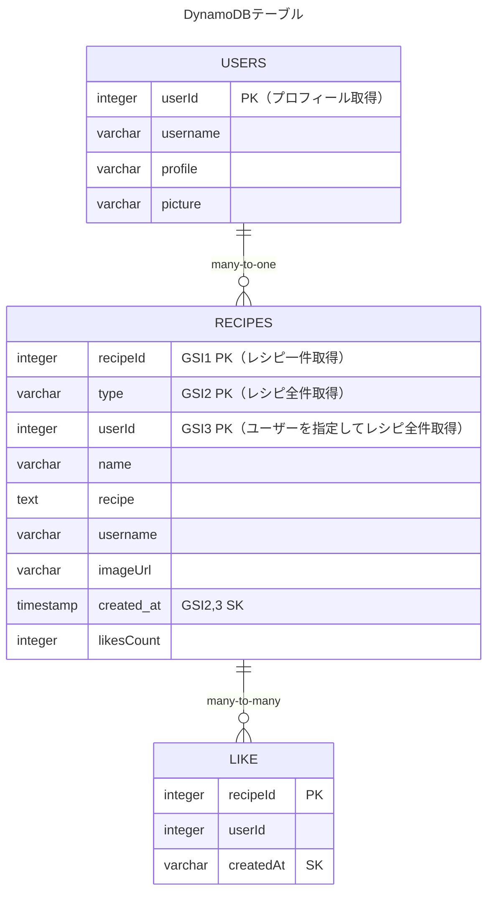

```mermaid

---
title: DynamoDBテーブル
---
erDiagram
    USERS {
      integer userId "PK（プロフィール取得）"
      varchar username
      varchar profile
      varchar picture
    }

    RECIPES {
      integer recipeId "GSI1 PK（レシピ一件取得）"
      varchar type "GSI2 PK（レシピ全件取得）"
      integer userId "GSI3 PK（ユーザーを指定してレシピ全件取得）"
      varchar name
      text recipe
      varchar username
      varchar imageUrl
      timestamp created_at "GSI2,3 SK"
      integer likesCount
    }

    LIKE {
      integer recipeId "PK"
      integer userId
      varchar createdAt "SK"
    }

    USERS ||--o{ RECIPES : "many-to-one"
    RECIPES ||--o{ LIKE : "many-to-many"


```
